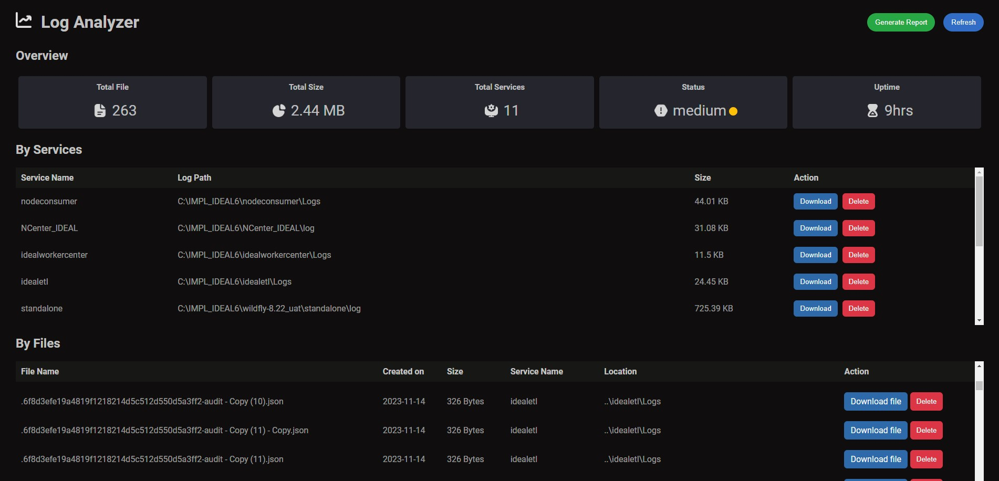

# Log Analyzer

[](https://nodejs.org/)
[](https://expressjs.com/)

Log Analyzer is a web application built with Node.js and Express.js for analyzing and managing log files.

## Preview



## Features

- Overview of log file statistics.
- List of log files with the ability to purge individual files.
- List of services generating logs with the ability to purge entire log folders.


## NOTE 
Download, Delete and Generate Button Functionality is Still Not Uploaded to the Branch, As I'm learning new things feel free to raise an issue, it will help me to solve and learn new things.

## Installation

1. Clone the repository:

    ```bash
    git clone https://github.com/your-username/log-analyzer.git
    ```

2. Install dependencies:

    ```bash
    cd log-analyzer
    npm install
    ```
## Configuration

Below is the configuration for log folders in your Log Analyzer application:
* make sure to change the inUse parameter to the one you want the app to fetch details for (product name).

```json
{
  "ideal6": {
    "logFolders": [
      ["foldername 1 or servicename 1", "../path to log folder 1"],
      ["foldername 1 or servicename 1", "../path to log folder 1"]
    ],
    "product": "ideal6"
  },
  "iwf6": {
    "logFolders": [
      ["foldername 1 or servicename 1", "../path to log folder 1"],
      ["foldername 1 or servicename 1", "../path to log folder 1"]
    ],
    "product": "iwf6"
  },
  "inUse": "ideal6"
}
```


## Usage

1. Start the server:

    ```bash
    npm start
    ```

2. Open your browser and navigate to [http://localhost:3000](http://localhost:3000) , Ports should be changed before using.


## Dependencies

- Node.js
- Express.js

## License

This project is licensed under the MIT License - see the [LICENSE](LICENSE) file for details.